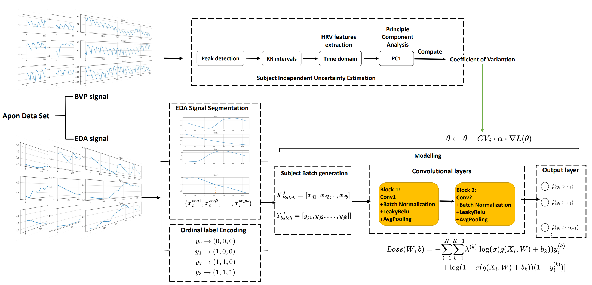

#  Unraveling Pain Levels: A Data-Uncertainty Guided Approach for Effective Pain Assessment

This code implements our designed learning framework for pain assessment.

# Dataset
The Biovid heat pain dataset, containing biosignals (ECG, EMG, and EDA), is the only publicly available resource of its kind. It is divided into two parts; we utilize part A, comprising 87 subjects with 100 data pieces each. These data correspond to different pain levels (T0, T1, T2, T3, T4), with 20 thermal stimulation experiments conducted for each level. Each signal recording lasts 5.5 seconds, with intervals of 8-12 seconds between adjacent stimuli. The original sampling rate is 512 HZ.

* Download link: https://drive.google.com/file/d/1ZqGLY0nsWKECNPPO9IcIBMJVAqGni8ag/view?usp=sharing

# Run examples

Requirements:

* Python 3.6
* Pytorch 2.1
* Scipy 1.11.0 
* Numpy 1.15.3
* Pandas 0.23.4

# Train the DUG-CORAL
Refer to the codes in 'main.ipynb'
